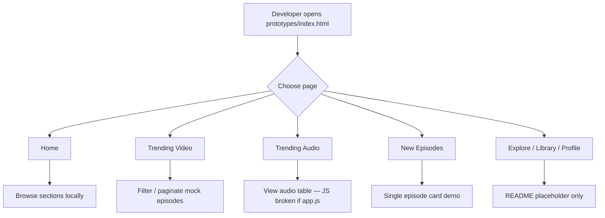

# Phase 0 — Foundation & Project Setup

| Field | Value |
|-------|--------|
| **Status** | ✅ Complete |
| **Date** | 2026-06-06 |
| **Goal** | یکپارچه‌سازی ساختار پروژه، تصمیمات محصول، IA، Git |
| **Next Phase** | [Phase 1 — Design System](./PHASE-1.md) |

---

## خلاصه

فاز ۰ پروژه را از مجموعه پراکنده HTML/CSS و Promptها به **ساختار monorepo-style** منتقل کرد: `docs/`, `prompts/`, `mockups/`, `prototypes/`, `plugin/`. تصمیمات برند (**Castory**)، MVP scope، و Information Architecture ثبت شد. Git initialize شد.

---

## فایل‌های ایجاد / تغییر یافته

### ایجاد شده

| Path | Action | توضیح |
|------|--------|--------|
| `docs/DECISIONS.md` | Created | ADR-001 تا ADR-007 — برند، MVP، i18n، assets |
| `docs/IA.md` | Created | Sidebar، breadcrumb، mobile nav، routing |
| `docs/review.md` | Moved | از root → `docs/` — audit Promptها |
| `docs/roadmap.md` | Moved | از root → `docs/` — برنامه توسعه |
| `README.md` | Created | معرفی پروژه + quick start |
| `.gitignore` | Created | OS, editor, node, secrets |
| `LICENSE` | Created | Proprietary |
| `mockups/MANIFEST.md` | Created | فهرست ۱۵ PNG موردنیاز |
| `prompts/*.txt` | Moved | ۷ فایل Prompt از root |
| `prototypes/index.html` | Created | Hub dev — لینک صفحات MVP |
| `prototypes/shared/` | Created | skeleton (tokens, reset, layout stubs) |
| `prototypes/explore/README.md` | Created | Placeholder v1.1 |
| `prototypes/library/README.md` | Created | Placeholder v1.1 |
| `prototypes/profile/README.md` | Created | Placeholder v1.1 |
| `prototypes/episode-detail/README.md` | Created | Placeholder v1.1 |
| `prototypes/_archive/README.md` | Created | توضیح نسخه‌های deprecated |
| `plugin/castory/README.md` | Created | Placeholder فاز ۸ |
| `.git/` | Created | `git init` |

### منتقل / rename شده

| From | To |
|------|-----|
| `HomePage/` | `prototypes/home/`, `trending-audio/`, `trending-video/`, `new-episodes/` |
| `HomePage/new-episoes/` | `prototypes/new-episodes/` |
| `HomePage/trending-audio-episodes/01/` | `prototypes/trending-audio/` |
| `HomePage/trending-video-episodes/Mobile/01/` | `prototypes/trending-video/` (canonical) |
| `Desktop/01`, `Desktop/02` | `prototypes/_archive/trending-video/` |
| `MockUps/*.png` | `mockups/` ⚠️ (بعداً به‌دلیل case-insensitivity Windows حذف شد — restore از backup) |

### تغییر نکرد (همان فاز ۰ قبل از migrate)

| Path | وضعیت |
|------|--------|
| `prototypes/home/*` | محتوا بدون تغییر — فقط مسیر |
| `prototypes/trending-video/*` | محتوا بدون تغییر |
| `prototypes/trending-audio/*` | محتوا بدون تغییر |
| `prototypes/new-episodes/*` | محتوا بدون تغییر |

---

## ترتیب Load (فاز ۰)

در فاز ۰ هر صفحه **هنوز CSS/JS محلی** دارد. ترتیب استاندارد فقط در Hub تعریف شد:

### Prototype Hub (`prototypes/index.html`)

```html
<!-- CSS -->
<link href="Google Fonts Inter">
<link rel="stylesheet" href="shared/css/tokens.css">   <!-- later → castory.css -->
<link rel="stylesheet" href="shared/css/reset.css">

<!-- JS -->
(بدون JS در hub)
```

### صفحات MVP (وضعیت فاز ۰ — local only)

| Page | CSS Load Order | JS Load Order |
|------|----------------|---------------|
| Home | `style.css` (local) | `script.js` |
| Trending Video | `styles.css` (local) | `app.js` |
| Trending Audio | `styles.css` (local) | `script.js` ⚠️ HTML refs `app.js` |
| New Episodes | `css/style.css` | `js/main.js` |

**CDN اضافی (Home):** Font Awesome 6, Google Fonts, Unsplash images.

---

## User Flow



### User Flow (End User — MVP intent)

```
Home
 ├── Hero carousel (auto)
 ├── Trending Video section → View All (not linked yet)
 ├── Trending Audio section
 ├── New Episodes section
 └── Sidebar nav (no hrefs yet)

Trending Video View All
 ├── Category pills → filter
 ├── Sort → partial bug on date strings
 └── Pagination

Trending Audio View All
 ├── Filter pills (UI)
 ├── Episode table
 └── Right sidebar filters

New Episodes
 ├── Filter pills
 └── Newsletter subscribe (client validation)
```

---

## Workflow توسعه (Dev)

```
1. Clone / open project
2. Read docs/DECISIONS.md + docs/IA.md
3. Open prototypes/index.html via Live Server (not file://)
4. Compare UI with mockups/MANIFEST.md (when PNGs restored)
5. Pick next task from docs/roadmap.md
6. Implement in prototypes/{page}/
7. Update docs/phases/PHASE-N.md at phase end
```

### Git Workflow (فاز ۰)

```bash
git init          # done
git add .
git commit -m "..." # optional — not done unless user requests
```

---

## API کلیدها (فاز ۰)

فاز ۰ **API runtime ندارد**. فقط تصمیمات و ساختار:

| Key / Concept | Location | Value |
|---------------|----------|--------|
| Brand | `DECISIONS.md` ADR-001 | `Castory` |
| Plugin slug | ADR-001 | `castory` |
| MVP pages | ADR-002 | home, trending-video, trending-audio, new-episodes |
| UI language | ADR-003 | `en`, LTR |
| Sidebar width | `IA.md` | 260px |
| Right panel | `IA.md` | 320px |
| Breadcrumb sep | `IA.md` | `›` |

**Shared JS API:** در فاز ۰ فقط stub (`Castory.debounce`, `CASTORY_MOCK` empty shell).

---

## Preview & Files

### Entry Points

| Purpose | File | Open via |
|---------|------|----------|
| Dev Hub | `prototypes/index.html` | Live Server root |
| Home | `prototypes/home/index.html` | Hub link |
| Trending Video | `prototypes/trending-video/index.html` | Hub link |
| Trending Audio | `prototypes/trending-audio/index.html` | Hub link |
| New Episodes | `prototypes/new-episodes/index.html` | Hub link |

### Documentation

| Doc | Path |
|-----|------|
| Product decisions | `docs/DECISIONS.md` |
| Navigation IA | `docs/IA.md` |
| Prompt audit | `docs/review.md` |
| Roadmap | `docs/roadmap.md` |
| Mockup list | `mockups/MANIFEST.md` |

### Prompts

```
prompts/HomePage-Prompt.txt
prompts/NewEpisodesPage-Prompt.txt
prompts/TrendingAudioEpisodes-prompt.txt
prompts/TrendingVideoEpisodes-ViewAll-Prompt.txt
prompts/ExplorePage-Prompt.txt
prompts/LibraryPage-Prompt.txt
prompts/ProfilePage-Prompt.txt
```

---

## وضعیت صفحات (پایان فاز ۰)

| Page | Path | Built | Shared DS | Linked Nav | Match MockUp | Notes |
|------|------|-------|-----------|------------|--------------|-------|
| **Home** | `prototypes/home/` | ✅ | ❌ local CSS | ❌ | ~75% | PodStream branding |
| **Trending Video** | `prototypes/trending-video/` | ✅ | ❌ | ❌ | ~85% | Canonical; best JS |
| **Trending Audio** | `prototypes/trending-audio/` | ✅ | ❌ | ❌ | ~80% | `app.js` bug |
| **New Episodes** | `prototypes/new-episodes/` | ⚠️ partial | ❌ | ❌ | ~40% | 1 card; missing assets |
| **Explore** | `prototypes/explore/` | ❌ | — | — | 0% | README only |
| **Library** | `prototypes/library/` | ❌ | — | — | 0% | README only |
| **Profile** | `prototypes/profile/` | ❌ | — | — | 0% | README only |
| **Episode Detail** | `prototypes/episode-detail/` | ❌ | — | — | 0% | README only |
| **Design System** | `prototypes/shared/` | ⚠️ stubs | — | — | — | Phase 1 scope |

**Legend:** ✅ Done | ⚠️ Partial | ❌ Not started

---

## Known Issues (carry to Phase 1+)

| # | Issue | Severity |
|---|--------|----------|
| 1 | MockUp PNGs deleted during `MockUps` → `mockups` rename on Windows | 🔴 |
| 2 | `trending-audio/index.html` loads `app.js` but file is `script.js` | 🔴 |
| 3 | Brand inconsistency: UI says PodStream, product is Castory | 🟡 |
| 4 | No cross-page navigation links | 🟡 |
| 5 | `new-episodes` missing local assets | 🔴 |

---

## Handoff → Phase 1

- [x] Folder structure stable
- [x] IA documented
- [x] MVP scope locked
- → Build full `prototypes/shared/` Design System
- → Create `castory.css` bundle + `mock-data.js` + component JS

---

*Previous phase: — | Next: [PHASE-1.md](./PHASE-1.md)*
