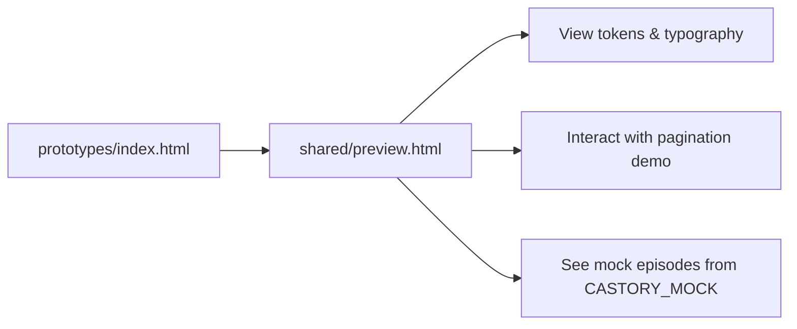

# Phase 1 — Shared Design System

| Field | Value |
|-------|--------|
| **Status** | ✅ Complete |
| **Date** | 2026-06-06 |
| **Goal** | CSS/JS مشترک — tokens, layout, components, mock data, utilities |
| **Prerequisite** | [Phase 0](./PHASE-0.md) |
| **Next Phase** | Phase 2 — Migrate MVP pages + bug fixes |

---

## خلاصه

فاز ۱ **Castory Design System** را به‌صورت bundle قابل import ساخت: `castory.css` (۱۰ فایل component CSS)، JavaScript utilities، mock data مرکزی (۲۰ episode)، و component helpers (Pagination, Filters, Sidebar). صفحات MVP **هنوز migrate نشده‌اند** — فقط Hub و Preview از shared system استفاده می‌کنند.

---

## فایل‌های ایجاد / تغییر یافته

### CSS — Core

| Path | Action |
|------|--------|
| `prototypes/shared/css/tokens.css` | **Updated** — full tokens + legacy aliases |
| `prototypes/shared/css/reset.css` | **Updated** — reset, scrollbar, a11y |
| `prototypes/shared/css/utilities.css` | **Created** — `.glass`, `.text-muted`, flex utils |
| `prototypes/shared/css/layout.css` | **Updated** — app shells, sidebar, breakpoints |
| `prototypes/shared/css/castory.css` | **Created** — single import bundle |

### CSS — Components

| Path | Action |
|------|--------|
| `components/buttons.css` | Created |
| `components/cards.css` | Created |
| `components/forms.css` | Created |
| `components/navigation.css` | Created |
| `components/badges.css` | Created |
| `components/player.css` | Created |
| `components/pagination.css` | Created |
| `components/tables.css` | Created |
| `components/charts.css` | Created |

### JavaScript

| Path | Action |
|------|--------|
| `prototypes/shared/js/utils.js` | **Updated** — full utility API |
| `prototypes/shared/js/mock-data.js` | **Updated** — 20 episodes, creators, nav, hero |
| `prototypes/shared/js/castory.js` | **Created** — `Castory.init()` bootstrap |
| `prototypes/shared/js/components/sidebar.js` | Created |
| `prototypes/shared/js/components/pagination.js` | Created |
| `prototypes/shared/js/components/filters.js` | Created |

### Documentation & Preview

| Path | Action |
|------|--------|
| `docs/DESIGN-SYSTEM.md` | Created |
| `prototypes/shared/preview.html` | Created — live component gallery |
| `prototypes/index.html` | **Updated** — uses `castory.css`, link to preview |
| `README.md` | **Updated** — DESIGN-SYSTEM link |
| `docs/roadmap.md` | **Updated** — Phase 1 marked complete |

### Assets

| Path | Action |
|------|--------|
| `prototypes/shared/assets/.gitkeep` | Created — placeholder for local assets |

### Not changed (Phase 2 scope)

```
prototypes/home/style.css
prototypes/home/script.js
prototypes/trending-video/styles.css + app.js
prototypes/trending-audio/styles.css + script.js
prototypes/new-episodes/css/style.css + js/main.js
```

---

## ترتیب Load

### CSS (Recommended — all pages after Phase 2 migration)

```html
<!-- 1. Fonts (external) -->
<link rel="preconnect" href="https://fonts.googleapis.com">
<link rel="preconnect" href="https://fonts.gstatic.com" crossorigin>
<link href="https://fonts.googleapis.com/css2?family=Inter:wght@400;500;600;700;800&display=swap" rel="stylesheet">

<!-- 2. Design System bundle -->
<link rel="stylesheet" href="../shared/css/castory.css">

<!-- 3. Page-specific overrides (optional) -->
<link rel="stylesheet" href="page.css">
```

**Internal `castory.css` import order:**

```
tokens.css
  → reset.css
  → utilities.css
  → layout.css
  → components/buttons.css
  → components/cards.css
  → components/forms.css
  → components/navigation.css
  → components/badges.css
  → components/player.css
  → components/pagination.css
  → components/tables.css
  → components/charts.css
```

### JavaScript (order is required)

```html
<!-- 1. Core utilities (no dependencies) -->
<script src="../shared/js/utils.js"></script>

<!-- 2. Mock data (uses Castory.formatRelativeDate if available) -->
<script src="../shared/js/mock-data.js"></script>

<!-- 3. Components (depend on utils) -->
<script src="../shared/js/components/sidebar.js"></script>
<script src="../shared/js/components/pagination.js"></script>
<script src="../shared/js/components/filters.js"></script>

<!-- 4. Bootstrap -->
<script src="../shared/js/castory.js"></script>

<!-- 5. Page logic -->
<script src="page.js"></script>
```

### Optional CDN (per page)

| Resource | Used on | URL |
|----------|---------|-----|
| Font Awesome 6 | Home (Phase 2+) | cdnjs.cloudflare.com |
| Unsplash / Picsum | All prototypes | image URLs in mock-data |

### Init call (end of body)

```javascript
document.addEventListener('DOMContentLoaded', function () {
  Castory.init({ sidebar: true, hydrateDates: true });
});
```

---

## User Flow

### Design System Preview



### Intended app flow (after Phase 2 linking)

```
Home ──View All──► Trending Video
  │                      │
  ├──View All──► Trending Audio
  │
  └──View All──► New Episodes

Sidebar / Bottom Nav ──► Library / Profile / Explore (v1.1)
Episode card click ──► Episode Detail (v1.1)
```

**Current state (Phase 1 end):** pages are isolated; only Hub → Preview → MVP pages via manual links.

---

## Workflow توسعه (Dev)

### Adding shared styles

```
1. Edit component file in prototypes/shared/css/components/
2. No change needed if using castory.css (@import already wired)
3. Verify in prototypes/shared/preview.html
4. Document token changes in docs/DESIGN-SYSTEM.md
```

### Adding mock data

```
1. Edit prototypes/shared/js/mock-data.js
2. Always set publishedAt (Unix ms) for sortable dates
3. Run preview.html to verify CASTORY_MOCK.episodes
4. Phase 2 pages consume same object
```

### Migrating a page (Phase 2 checklist preview)

```
1. Add castory.css link before page CSS
2. Remove duplicate :root tokens from page CSS
3. Replace local episode arrays with CASTORY_MOCK
4. Replace pagination logic with Castory.Pagination.render()
5. Replace pill handlers with Castory.Filters.initPills()
6. Test mobile drawer with Castory.Sidebar.init()
```

---

## API کلیدها

### Global: `window.Castory`

| Method / Property | Signature | Description |
|-------------------|-----------|-------------|
| `Castory.qs` | `(selector, root?) → Element` | querySelector wrapper |
| `Castory.qsa` | `(selector, root?) → Element[]` | querySelectorAll wrapper |
| `Castory.debounce` | `(fn, ms) → Function` | debounced function |
| `Castory.formatRelativeDate` | `(timestamp) → string` | `"6 hrs ago"`, `"2 days ago"` |
| `Castory.formatViews` | `(count) → string` | `2100000` → `"2.1M"` |
| `Castory.filterEpisodes` | `(episodes, opts) → Episode[]` | filter by category, mediaType, search |
| `Castory.sortEpisodes` | `(episodes, sortBy) → Episode[]` | `Most Popular` \| `Newest` \| `Oldest` |
| `Castory.paginate` | `(items, page, pageSize) → items[]` | slice for current page |
| `Castory.getTotalPages` | `(total, pageSize) → number` | pagination math |
| `Castory.init` | `(options?) → void` | sidebar + hydrate dates |

### `Castory.Pagination`

```javascript
Castory.Pagination.render(containerElement, {
  currentPage: 1,
  totalPages: 5,
  maxVisible: 7,
  prevLabel: '‹',
  nextLabel: '›',
  onChange: (page) => { /* update state */ }
});
```

### `Castory.Filters`

```javascript
Castory.Filters.initPills('.pill', {
  group: '.category-pills',
  onChange: (label, pillEl) => { /* filter */ }
});

Castory.Filters.initRadios('duration', { onChange: (value) => {} });
Castory.Filters.getActivePill('.filter-pills'); // → "All"
```

### `Castory.Sidebar`

```javascript
Castory.Sidebar.init({
  menuBtn: '#mobileMenu',  // default selectors built-in
  sidebar: '#sidebar'
});
// Adds: .sidebar--drawer, .sidebar--open, backdrop, Escape close
```

### Global: `window.CASTORY_MOCK`

| Key | Type | Description |
|-----|------|-------------|
| `brand` | string | `"Castory"` |
| `categories` | string[] | 10 filter categories |
| `audioFilterCategories` | string[] | Trending Audio pills |
| `nav` | NavItem[] | Desktop sidebar links |
| `mobileNav` | NavItem[] | Bottom nav items |
| `user` | object | Default profile (Emma Watson) |
| `heroSlides` | array | Home carousel data |
| `creators` | array | Top creators widget |
| `topics` | string[] | Trending topics |
| `episodes` | Episode[] | **20 items** with `publishedAt` |
| `topPodcasts` | array | Audio sidebar ranking |

### Episode object schema

```javascript
{
  id: number,
  title: string,
  creator: string,
  verified: boolean,
  category: string,
  mediaType: 'video' | 'audio',
  views: string,           // display: "2.1M"
  viewsCount: number,      // sort: 2100000
  publishedAt: number,     // Unix ms — REQUIRED for sort
  date: string,            // computed: "6 hrs ago"
  duration: string,        // "52:10"
  thumbnail: string,       // URL
  podcast: string,         // optional
  description: string      // optional
}
```

### CSS class API (most used)

| Class | Component file |
|-------|----------------|
| `.app-layout`, `.app-three-col` | layout.css |
| `.sidebar`, `.sidebar--drawer`, `.sidebar--open` | layout.css |
| `.main-content`, `.right-panel` | layout.css |
| `.btn-primary`, `.pill`, `.icon-btn` | buttons.css |
| `.glass-card`, `.episode-card`, `.feed-card` | cards.css |
| `.search-box`, `.filter-pills` | forms.css |
| `.nav-item`, `.breadcrumb`, `.bottom-nav` | navigation.css |
| `.badge-video`, `.badge-audio`, `.duration` | badges.css |
| `.mini-player`, `.player-progress` | player.css |
| `.pagination`, `.page-btn` | pagination.css |
| `.episode-row`, `.table-header` | tables.css |
| `.bar-chart`, `.heatmap` | charts.css |

### CSS variables (most used)

```css
--color-bg-primary      #050816
--color-primary         #7C3AED
--color-success         #22C55E
--sidebar-width         260px
--right-panel-width     320px
--space-4               16px
--radius-md             16px
--shadow-hover          purple glow
--transition            0.25s ease
```

Legacy aliases: `--bg`, `--primary`, `--purple`, `--card` → map to new tokens.

---

## Preview & Files

### Open in browser (Live Server)

| Preview | Path | Shows |
|---------|------|--------|
| **Prototype Hub** | `prototypes/index.html` | Links to MVP + Design System |
| **Design System Gallery** | `prototypes/shared/preview.html` | All components live |
| Home | `prototypes/home/index.html` | Local CSS only |
| Trending Video | `prototypes/trending-video/index.html` | Local CSS + app.js |
| Trending Audio | `prototypes/trending-audio/index.html` | Local CSS — JS bug |
| New Episodes | `prototypes/new-episodes/index.html` | Local CSS — partial |

### File tree (Design System)

```
prototypes/shared/
├── preview.html                 ← START HERE for DS review
├── css/
│   ├── castory.css              ← single link for pages
│   ├── tokens.css
│   ├── reset.css
│   ├── utilities.css
│   ├── layout.css
│   └── components/              ← 9 files
├── js/
│   ├── utils.js
│   ├── mock-data.js
│   ├── castory.js
│   └── components/
│       ├── sidebar.js
│       ├── pagination.js
│       └── filters.js
└── assets/
    └── .gitkeep
```

### Documentation

| Doc | Path |
|-----|------|
| Design System reference | `docs/DESIGN-SYSTEM.md` |
| This report | `docs/phases/PHASE-1.md` |
| Phase index | `docs/phases/README.md` |

---

## وضعیت صفحات (پایان فاز ۱)

| Page | HTML | Local CSS | Uses `castory.css` | Uses `CASTORY_MOCK` | Functional | Ready for Phase 2 |
|------|------|-----------|--------------------|----------------------|------------|-------------------|
| **Hub** | ✅ | ✅ shared | ✅ | ❌ | ✅ | — |
| **DS Preview** | ✅ | ✅ shared | ✅ | ✅ | ✅ | — |
| **Home** | ✅ | ✅ local | ❌ | ❌ | ⚠️ ~75% | Migrate |
| **Trending Video** | ✅ | ✅ local | ❌ | ❌ duplicate data | ⚠️ sort bug | Migrate |
| **Trending Audio** | ✅ | ✅ local | ❌ | ❌ | ❌ JS broken | Migrate + fix |
| **New Episodes** | ⚠️ | ✅ local | ❌ | ❌ | ⚠️ ~40% | Migrate + assets |
| **Explore** | ❌ | — | — | — | ❌ | Build v1.1 |
| **Library** | ❌ | — | — | — | ❌ | Build v1.1 |
| **Profile** | ❌ | — | — | — | ❌ | Build v1.1 |
| **Episode Detail** | ❌ | — | — | — | ❌ | Build v1.1 |

---

## Known Issues

| # | Issue | Fix in |
|---|--------|--------|
| 1 | MVP pages not using shared CSS yet | Phase 2 |
| 2 | `trending-audio` → wrong script src `app.js` | Phase 2 |
| 3 | `trending-video/app.js` sorts `"6 hrs ago"` strings | Phase 2 → use `CASTORY_MOCK` |
| 4 | MockUp PNGs restored ✅ — pixel QA: [QA-MOCKUP-CHECKLIST.md](../QA-MOCKUP-CHECKLIST.md) | 🟡 QA pending |
| 5 | UI brand still "PodStream" in pages | Phase 2 |
| 6 | `@import` in castory.css may flash on slow networks | Optional: bundle/minify later |

---

## Handoff → Phase 2

Priority tasks:

1. **Home** — add `castory.css`, hero fixes, nav links, search all sections
2. **Trending Video** — replace `app.js` data with `CASTORY_MOCK` + shared Pagination/Filters
3. **Trending Audio** — fix script tag, migrate to shared table styles
4. **New Episodes** — full episode list from mock-data, assets, pagination
5. Cross-link all MVP pages per `docs/IA.md`
6. Rename PodStream → Castory in UI

After Phase 2, create **`docs/phases/PHASE-2.md`** using same template as this file.

---

*Previous: [PHASE-0.md](./PHASE-0.md) | Next: PHASE-2.md (pending)*
