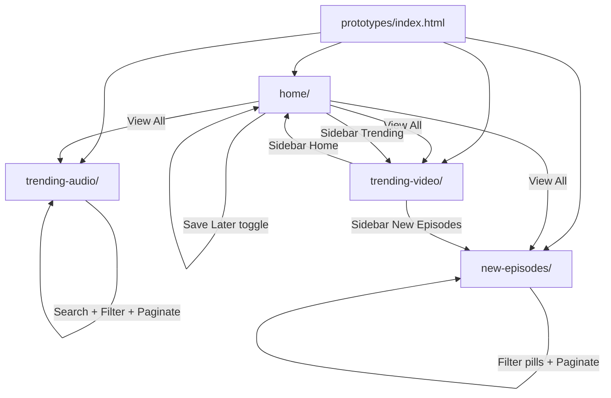

# Phase 2 — MVP Pages Migration & Bug Fixes

| Field | Value |
|-------|--------|
| **Status** | ✅ Complete |
| **Date** | 2026-06-06 |
| **Goal** | Migrate 4 MVP pages to shared Design System, fix critical bugs, cross-link navigation |
| **Prerequisite** | [Phase 1](./PHASE-1.md) |
| **Next Phase** | Phase 3 — Explore Page |

---

## خلاصه

هر ۴ صفحه MVP به **`castory.css` + `page.css`** migrate شدند. داده‌ها از **`CASTORY_MOCK`** می‌آیند. باگ‌های بحرانی (`app.js`، sort تاریخ، assets گم‌شده) برطرف شد. برند **Castory** جایگزین PodStream شد. Navigation بین صفحات MVP فعال است.

---

## فایل‌های ایجاد / تغییر یافته

### Home (`prototypes/home/`)

| File | Action |
|------|--------|
| `index.html` | Rewritten — Castory, nav links, View All, shared CSS |
| `home/home.css` | **Created** → renamed `page.css` in Phase 8 prep |
| `script.js` | Rewritten — carousel, search all sections, chips, CASTORY_MOCK render |
| `style.css` | **Deleted** — replaced by shared + home.css |

### Trending Video (`prototypes/trending-video/`)

| File | Action |
|------|--------|
| `index.html` | Updated — castory.css, nav `<a>`, bottom nav links, shared JS |
| `page.css` | **Created** — hero visual, filters layout |
| `app.js` | Rewritten — `CASTORY_MOCK.getVideoEpisodes()`, sort fix, Pagination, search |
| `styles.css` | Unchanged on disk (bypassed — use `page.css` only) |

### Trending Audio (`prototypes/trending-audio/`)

| File | Action |
|------|--------|
| `index.html` | Updated — script fix, dynamic `#episodesList`, Castory branding |
| `page.css` | **Created** — hero waves, grid layout |
| `script.js` | Rewritten — full table render, filters, pagination, search, sidebar |
| `styles.css` | Bypassed |

### New Episodes (`prototypes/new-episodes/`)

| File | Action |
|------|--------|
| `index.html` | Rewritten — 3-col layout, Unsplash assets, shared stack |
| `page.css` | **Created** — list rows 110px, responsive |
| `js/main.js` | Rewritten — 15+ episodes, pagination, filters, newsletter |
| `css/style.css` | Bypassed (legacy) |

### Shared

| File | Action |
|------|--------|
| `shared/js/mock-data.js` | +2 audio episodes (Daily Habits, Space), `routes`, `getVideoEpisodes()`, `getAudioEpisodes()`, `getNewestEpisodes()` |
| `prototypes/index.html` | Hub descriptions updated |

---

## ترتیب Load

### Standard MVP stack (all 4 pages)

```html
<!-- CSS -->
<link href="Google Fonts Inter">
<link rel="stylesheet" href="../shared/css/castory.css">
<link rel="stylesheet" href="page.css">        <!-- or home.css for home -->

<!-- JS (order required) -->
<script src="../shared/js/utils.js"></script>
<script src="../shared/js/mock-data.js"></script>
<script src="../shared/js/components/sidebar.js"></script>   <!-- audio, new-episodes -->
<script src="../shared/js/components/pagination.js"></script> <!-- video, audio, new-episodes -->
<script src="../shared/js/components/filters.js"></script>    <!-- audio, new-episodes -->
<script src="../shared/js/castory.js"></script>
<script src="script.js"></script>  <!-- or app.js / js/main.js -->
```

### Home-only extras

```html
<link rel="stylesheet" href="font-awesome CDN">
<!-- No pagination.js — carousel is local -->
```

### Per-page JS entry

| Page | Entry file |
|------|------------|
| Home | `home/script.js` |
| Trending Video | `trending-video/app.js` |
| Trending Audio | `trending-audio/script.js` |
| New Episodes | `new-episodes/js/main.js` |

---

## User Flow



### End-user journeys (MVP)

1. **Discover on Home** → scroll sections → View All → dedicated list page  
2. **Browse Trending Video** → filter category → sort → paginate → search  
3. **Browse Trending Audio** → table view → duration/published filters → bookmark  
4. **New Episodes** → filter All/Video/Audio/Category → paginate → subscribe newsletter  

---

## Workflow توسعه (Dev)

```
1. Open prototypes/index.html (Live Server)
2. Edit shared mock-data.js for content changes (single source)
3. Page-specific UI → page.css / home.css only
4. Page logic → script.js / app.js / main.js using Castory.* APIs
5. Test mobile ≤768px (bottom nav, sidebar drawer on audio/new-episodes)
6. Update docs/phases/PHASE-N.md at phase end
```

### Data flow

```
CASTORY_MOCK (mock-data.js)
    ↓
Castory.filterEpisodes / sortEpisodes / paginate
    ↓
DOM render in page script
    ↓
Castory.Pagination.render / Filters.initPills
```

---

## API کلیدها

### Used in Phase 2

| API | Used on |
|-----|---------|
| `CASTORY_MOCK.heroSlides` | Home carousel |
| `CASTORY_MOCK.getVideoEpisodes()` | Home grid, Trending Video |
| `CASTORY_MOCK.getAudioEpisodes()` | Home audio, Trending Audio |
| `CASTORY_MOCK.getNewestEpisodes(n)` | Home new grid, New Episodes list |
| `CASTORY_MOCK.creators` | Home, New Episodes sidebar |
| `CASTORY_MOCK.topics` | Home right panel |
| `CASTORY_MOCK.routes` | Reference paths (documented) |
| `Castory.filterEpisodes(list, { category, mediaType, search })` | All list pages |
| `Castory.sortEpisodes(list, sortBy)` | Video, Audio |
| `Castory.paginate(list, page, size)` | All paginated pages |
| `Castory.getTotalPages(total, size)` | Pagination |
| `Castory.Pagination.render(el, opts)` | Video, Audio, New Episodes |
| `Castory.Filters.initPills(selector, opts)` | Trending Audio |
| `Castory.Sidebar.init(opts)` | Trending Audio, New Episodes |
| `Castory.debounce(fn, ms)` | Search inputs |
| `Castory.formatRelativeDate(timestamp)` | Via mock-data hydration |

### Episode fields required for sort/filter

```javascript
publishedAt  // Unix ms — REQUIRED
viewsCount   // number — for Most Popular
mediaType    // 'video' | 'audio'
category     // string
```

---

## Preview & Files

| Page | Preview URL | Entry CSS | Entry JS |
|------|-------------|-----------|----------|
| Hub | `prototypes/index.html` | castory.css | — |
| Home | `prototypes/home/index.html` | castory.css + home.css | script.js |
| Trending Video | `prototypes/trending-video/index.html` | castory.css + page.css | app.js |
| Trending Audio | `prototypes/trending-audio/index.html` | castory.css + page.css | script.js |
| New Episodes | `prototypes/new-episodes/index.html` | castory.css + page.css | js/main.js |
| Design System | `prototypes/shared/preview.html` | castory.css | utils + mock-data |

**Run:** Live Server from `prototypes/` — avoid `file://` for fonts/CDN.

---

## وضعیت صفحات (پایان فاز ۲)

| Page | Shared DS | CASTORY_MOCK | Nav Linked | Functional | vs MockUp |
|------|-----------|--------------|------------|------------|-----------|
| **Home** | ✅ | ✅ | ✅ | ✅ ~90% | ⚠️ PNGs missing |
| **Trending Video** | ✅ | ✅ | ✅ | ✅ ~90% | ⚠️ |
| **Trending Audio** | ✅ | ✅ | ✅ | ✅ ~90% | ⚠️ |
| **New Episodes** | ✅ | ✅ | ✅ | ✅ ~85% | ⚠️ |
| Explore | — | — | — | ❌ v1.1 | — |
| Library | — | — | placeholder href | ❌ v1.1 | — |
| Profile | — | — | placeholder href | ❌ v1.1 | — |

### Phase 2 checklist (roadmap)

- [x] Home → shared DS + hero dots + pause + search all sections  
- [x] Home → View All links + nav hrefs + Create dropdown + Save Later  
- [x] Home → audio cards with thumbnail + duration  
- [x] Trending Video → CASTORY_MOCK + sort fix + Pagination + search  
- [x] Trending Audio → fix `script.js` load + dynamic table + filters  
- [x] New Episodes → 15+ episodes + pagination + filters + Unsplash assets  
- [x] Brand PodStream → **Castory**  
- [ ] MockUp pixel QA — blocked until PNG restore  
- [x] Trending Audio sidebar nav full hrefs  

---

## Known Issues

| # | Issue | Severity |
|---|--------|----------|
| 1 | MockUp PNGs still missing in `mockups/` | 🟡 |
| 2 | `styles.css` legacy files still on disk (unused) | 🟢 cleanup |
| 3 | Library/Explore/Profile links → README placeholders | 🟡 expected v1.1 |
| 4 | Trending Audio sidebar nav — now linked | ✅ fixed |
| 5 | Home chips: first load shows "All" but Technology chip logic was fixed | ✅ |

---

## Handoff → Phase 3

- [ ] Build `prototypes/explore/index.html` from `prompts/ExplorePage-Prompt.txt`
- [ ] Optional: delete legacy `styles.css` files
- [ ] Restore mockup PNGs for QA
- [ ] Shared nav partial component (reduce duplicated sidebar HTML)

---

*Previous: [PHASE-1.md](./PHASE-1.md) | Next: PHASE-3.md (pending)*
