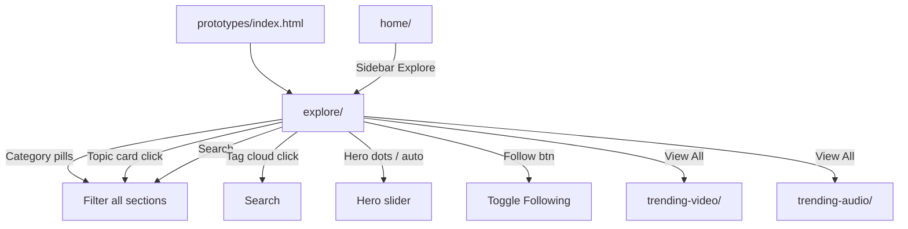

# Phase 3 — Explore Page

| Field | Value |
|-------|--------|
| **Status** | ✅ Complete |
| **Date** | 2026-06-06 |
| **Goal** | Build Explore discovery dashboard from prompt + shared Design System |
| **Prerequisite** | [Phase 2](./PHASE-2.md) |
| **Next Phase** | Phase 4 — Library Page |

---

## خلاصه

صفحه **Explore** از صفر ساخته شد: layout سه‌ستونه، hero slider «Discover New Voices»، ۸ topic card، creators scroll، video/audio/recommended sections، و right panel widgets. همه داده‌ها از **`CASTORY_MOCK`** (با فیلدهای explore جدید) و APIهای **`Castory.*`** می‌آیند.

---

## فایل‌های ایجاد / تغییر یافته

### Explore (`prototypes/explore/`)

| File | Action |
|------|--------|
| `index.html` | **Created** — full 3-col layout, sidebar, header, sections, right panel |
| `page.css` | **Created** — hero split, topic cards, audio rows, widgets, responsive |
| `script.js` | **Created** — carousel, filters, search, follow toggle, dynamic render |
| `README.md` | **Updated** — status Built |

### Shared

| File | Action |
|------|--------|
| `shared/js/mock-data.js` | +`exploreHeroSlides`, `trendingTopicsExplore`, `tagCloud`, `discoveryStats`, `mostFollowedTopics`, `popularCreators`, `routes.explore`, helpers |

### Cross-links & Docs

| File | Action |
|------|--------|
| `prototypes/home/index.html` | +Explore nav link |
| `prototypes/index.html` | Hub — Explore marked done |
| `docs/IA.md` | Explore status → Built |
| `docs/roadmap.md` | Phase 3 checkboxes updated |
| `docs/phases/README.md` | Phase 3 entry |

---

## ترتیب Load

```html
<!-- CSS -->
<link href="Google Fonts Inter">
<link rel="stylesheet" href="font-awesome CDN">
<link rel="stylesheet" href="../shared/css/castory.css">
<link rel="stylesheet" href="page.css">

<!-- JS -->
<script src="../shared/js/utils.js"></script>
<script src="../shared/js/mock-data.js"></script>
<script src="../shared/js/components/sidebar.js"></script>
<script src="../shared/js/components/filters.js"></script>
<script src="../shared/js/castory.js"></script>
<script src="script.js"></script>
```

---

## User Flow



### End-user journeys

1. **Browse by category** → Technology pill (default) → filtered video/audio/recommended  
2. **Deep-dive topic** → click AI/Startups card → category sync + highlight  
3. **Discover creators** → horizontal scroll → Follow toggle  
4. **Listen preview** → audio rows with animated waveform + play button  
5. **Mobile** → bottom nav + sidebar drawer  

---

## Workflow توسعه

```
1. Open prototypes/explore/index.html via Live Server
2. Content changes → mock-data.js (explore* fields)
3. Layout/visual tweaks → page.css only
4. Interactions → script.js using Castory APIs
5. Test ≤768px (bottom nav, drawer, stacked hero)
6. Document in PHASE-N.md at phase end
```

---

## API کلیدها

| API / Data | Usage on Explore |
|------------|------------------|
| `CASTORY_MOCK.exploreHeroSlides` | Hero carousel |
| `CASTORY_MOCK.trendingTopicsExplore` | 8 topic cards |
| `CASTORY_MOCK.popularCreators` | Horizontal creator scroll |
| `CASTORY_MOCK.getVideoEpisodes()` | Popular Video grid |
| `CASTORY_MOCK.getAudioEpisodes()` | Audio rows + waveform |
| `CASTORY_MOCK.getRecommendedEpisodes(n)` | Recommended For You |
| `CASTORY_MOCK.topPodcasts` | Top Creators ranking widget |
| `CASTORY_MOCK.tagCloud` | Tag cloud sidebar |
| `CASTORY_MOCK.discoveryStats` | Stats cards |
| `CASTORY_MOCK.mostFollowedTopics` | Progress bars |
| `CASTORY_MOCK.getCreatorById(id)` | Hero avatar stack |
| `CASTORY_MOCK.routes.explore` | Cross-page links |
| `Castory.filterEpisodes(list, opts)` | Category + search filter |
| `Castory.Filters.initPills()` | Category bar |
| `Castory.Sidebar.init()` | Mobile drawer |
| `Castory.debounce()` | Search input |

---

## Preview & Files

| Resource | Path |
|----------|------|
| **Preview** | `prototypes/explore/index.html` |
| Entry CSS | `castory.css` + `page.css` |
| Entry JS | `script.js` |
| Prompt | `prompts/ExplorePage-Prompt.txt` |
| MockUp refs | `mockups/Castory-explorePage-*` ✅ — QA: [QA-MOCKUP-CHECKLIST.md](../QA-MOCKUP-CHECKLIST.md) |

---

## وضعیت صفحات

| Section | Built | Interactive | vs MockUp |
|---------|-------|-------------|-----------|
| Sidebar (Explore active) | ✅ | ✅ linked | 🟡 QA pending |
| Header + search | ✅ | ✅ | ✅ |
| Category pills | ✅ | ✅ filter | ✅ |
| Hero slider | ✅ | ✅ dots + pause | ✅ |
| Trending Topics (8) | ✅ | ✅ click highlight | ✅ |
| Popular Creators | ✅ | ✅ follow toggle | ✅ |
| Popular Video | ✅ | ✅ filtered | ✅ |
| Explore Audio | ✅ | ✅ waveform CSS | ✅ |
| Recommended For You | ✅ | ✅ badges | ✅ |
| Right panel (4 widgets) | ✅ | ✅ tag search | ✅ |
| Tablet stack | ✅ | — | ✅ |
| Mobile bottom nav | ✅ | ✅ | ✅ |

---

## Known Issues

| # | Issue | Severity |
|---|--------|----------|
| 1 | MockUp pixel QA pending (PNGs restored ✅) | 🟡 |
| 2 | Placeholder nav items (Categories, Community, etc.) → `#` | 🟡 expected |
| 3 | Advanced Search button — UI only | 🟢 |
| 4 | `prefers-reduced-motion` for hero carousel not added | 🟢 |

---

## Handoff → Phase 4

- [ ] Build `prototypes/library/index.html` from `prompts/LibraryPage-Prompt.txt`
- [x] Restore mockup PNGs for Explore QA
- [ ] Run Explore pixel QA — [QA-MOCKUP-CHECKLIST.md](../QA-MOCKUP-CHECKLIST.md) §5
- [ ] Shared nav partial to reduce duplicated sidebar HTML
- [ ] Optional: add Explore to mobile nav on all MVP pages

---

*Previous: [PHASE-2.md](./PHASE-2.md) | Next: PHASE-4.md (pending)*
