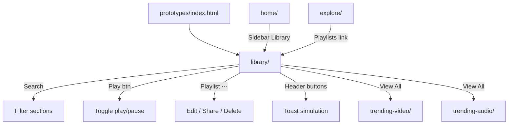

# Phase 4 — Library Page

| Field | Value |
|-------|--------|
| **Status** | ✅ Complete |
| **Date** | 2026-06-06 |
| **Goal** | Build personal Library dashboard from prompt + shared Design System |
| **Prerequisite** | [Phase 1](./PHASE-1.md) |
| **Next Phase** | Phase 5 — Profile Page |

---

## خلاصه

صفحه **Library** با layout سه‌ستونه (sidebar 240px)، ۶ section اصلی، و ۴ widget در right panel ساخته شد. داده‌ها از **`CASTORY_MOCK.library`** و **`CASTORY_MOCK.user`** می‌آیند. تعاملات: play/pause، playlist menu، search، toast notifications، mobile drawer.

---

## فایل‌های ایجاد / تغییر یافته

### Library (`prototypes/library/`)

| File | Action |
|------|--------|
| `index.html` | **Created** — sidebar My Library active, header actions, 6 sections, 4 widgets |
| `page.css` | **Created** — stats grid, continue cards, playlists collage, downloads, insights |
| `script.js` | **Created** — dynamic render, play toggle, playlist menu, search, sidebar actions |
| `README.md` | **Updated** — status Built |

### Shared

| File | Action |
|------|--------|
| `shared/js/mock-data.js` | +`user.following/followers/episodesCount`, +`library` object (stats, continue*, playlists, downloaded, saved, activity, storage, watchlist, insights) |

### Docs & Hub

| File | Action |
|------|--------|
| `prototypes/index.html` | Library marked done |
| `docs/IA.md` | Library → Built |
| `docs/roadmap.md` | Phase 4 checkboxes updated |
| `docs/phases/README.md` | Phase 4 entry |

---

## ترتیب Load

```html
<link rel="stylesheet" href="../shared/css/castory.css">
<link rel="stylesheet" href="page.css">

<script src="../shared/js/utils.js"></script>
<script src="../shared/js/mock-data.js"></script>
<script src="../shared/js/components/sidebar.js"></script>
<script src="../shared/js/castory.js"></script>
<script src="script.js"></script>
```

---

## User Flow



---

## API کلیدها

| API / Data | Usage |
|------------|-------|
| `CASTORY_MOCK.user` | Profile card + stats |
| `CASTORY_MOCK.library.stats` | 6 analytics cards |
| `CASTORY_MOCK.library.continueListening` | Audio cards + waveform + progress |
| `CASTORY_MOCK.library.continueWatching` | Video cards + watch progress |
| `CASTORY_MOCK.library.playlists` | Collage grid + menu |
| `CASTORY_MOCK.library.downloaded` | Download rows |
| `CASTORY_MOCK.library.savedForLater` | Saved cards + badges |
| `CASTORY_MOCK.library.recentActivity` | Timeline widget |
| `CASTORY_MOCK.library.storage` | Usage bar + breakdown |
| `CASTORY_MOCK.library.watchlistSummary` | Summary stats + CTA |
| `CASTORY_MOCK.library.listeningInsights` | Bar chart + categories + leaderboard |
| `Castory.Sidebar.init()` | Mobile drawer |
| `Castory.debounce()` | Search input |

---

## Preview & Files

| Resource | Path |
|----------|------|
| **Preview** | `prototypes/library/index.html` |
| Prompt | `prompts/LibraryPage-Prompt.txt` |
| MockUp refs | `mockups/Castory-libraryPage-*` ✅ — QA: [QA-MOCKUP-CHECKLIST.md](../QA-MOCKUP-CHECKLIST.md) |

---

## وضعیت صفحات

| Section | Built | Interactive |
|---------|-------|-------------|
| Sidebar (My Library active) | ✅ | ✅ Settings/Logout toast |
| Profile card + stats | ✅ | ✅ |
| Header + search | ✅ | ✅ |
| Stats Overview (6) | ✅ | — |
| Continue Listening | ✅ | ✅ play toggle |
| Continue Watching | ✅ | ✅ progress display |
| My Playlists (4) | ✅ | ✅ ⋯ menu |
| Downloaded Content | ✅ | — |
| Saved For Later | ✅ | — |
| Recent Activity | ✅ | — |
| Storage Usage | ✅ | — |
| Watchlist Summary | ✅ | ✅ CTA |
| Listening Insights | ✅ | ✅ bar chart hover |
| Mobile responsive | ✅ | ✅ bottom nav + drawer |

---

## Known Issues

| # | Issue | Severity |
|---|--------|----------|
| 1 | MockUp pixel QA pending (PNGs restored ✅) | 🟡 |
| 2 | Header actions — toast simulation only | 🟢 expected |
| 3 | Watch Later / Downloads nav → `#` placeholder | 🟡 v2 |

---

## Handoff → Phase 5

- [ ] Build `prototypes/profile/index.html` from `prompts/ProfilePage-Prompt.txt`
- [ ] Shared nav partial component
- [x] Restore mockup PNGs for Library QA
- [ ] Run Library pixel QA — [QA-MOCKUP-CHECKLIST.md](../QA-MOCKUP-CHECKLIST.md) §6

---

*Previous: [PHASE-3.md](./PHASE-3.md) | Next: PHASE-5.md (pending)*
