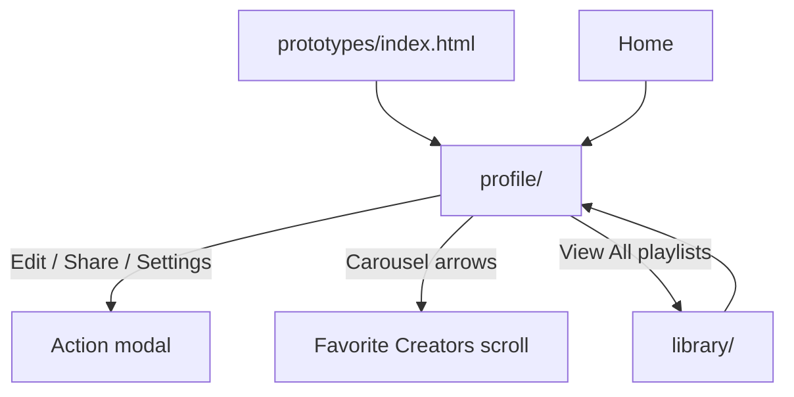

# Phase 5 — Profile Page

| Field | Value |
|-------|--------|
| **Status** | ✅ Complete |
| **Date** | 2026-06-06 |
| **Goal** | Build Profile dashboard from prompt + shared Design System |
| **Prerequisite** | [Phase 1](./PHASE-1.md) |
| **Next Phase** | Phase 6 — Episode Detail Pages |

---

## خلاصه

صفحه **Profile** با hero cover، avatar ring، stats row، achievements، timeline، carousel creators، playlists (از library)، watch history، heatmap و right panel widgets ساخته شد. داده‌ها از **`CASTORY_MOCK.user`** + **`CASTORY_MOCK.profile`** + reuse **`CASTORY_MOCK.library`**.

---

## فایل‌های ایجاد / تغییر یافته

### Profile (`prototypes/profile/`)

| File | Action |
|------|--------|
| `index.html` | **Created** — sidebar 280px, hero, 8 main sections, 6 widgets, modal |
| `page.css` | **Created** — cover, avatar ring, achievements themes, carousel, heatmap, modal |
| `script.js` | **Created** — full render, carousel arrows, modal handlers, SVG line chart |
| `README.md` | **Updated** — status Built |

### Shared

| File | Action |
|------|--------|
| `shared/js/mock-data.js` | Extended `user` (bio, location, cover, verified…), +`profile` object, +`heatmapLevels`, +`generateHeatmap()` |

### Docs

| File | Action |
|------|--------|
| `prototypes/index.html` | Profile marked done |
| `docs/IA.md` | Profile → Built |
| `docs/roadmap.md` | Phase 5 checkboxes |
| `docs/phases/README.md` | Phase 5 entry |

---

## ترتیب Load

```html
<link rel="stylesheet" href="../shared/css/castory.css">
<link rel="stylesheet" href="page.css">

<script src="../shared/js/utils.js"></script>
<script src="../shared/js/mock-data.js"></script>
<script src="../shared/js/components/sidebar.js"></script>
<script src="../shared/js/castory.js"></script>
<script src="script.js"></script>
```

---

## User Flow



---

## API کلیدها

| Data | Usage |
|------|-------|
| `CASTORY_MOCK.user` | Hero, sidebar profile card |
| `CASTORY_MOCK.profile.stats` | Stats row (5 metrics) |
| `CASTORY_MOCK.profile.achievements` | 4 gradient cards |
| `CASTORY_MOCK.profile.listeningTimeline` | Activity timeline |
| `CASTORY_MOCK.profile.favoriteCreators` | Carousel |
| `CASTORY_MOCK.library.playlists` | My Playlists grid |
| `CASTORY_MOCK.library.savedForLater` | Saved episodes scroll |
| `CASTORY_MOCK.profile.watchHistory` | History cards + progress |
| `CASTORY_MOCK.profile.topCategories` | Category cards |
| `CASTORY_MOCK.profile.recentlyCompleted` | Completed list |
| `CASTORY_MOCK.profile.insights` | SVG line chart + metrics |
| `CASTORY_MOCK.profile.followingSummary` | Following widget |
| `CASTORY_MOCK.profile.accountStatus` | Account card |
| `CASTORY_MOCK.library.storage` | Storage widget |
| `CASTORY_MOCK.profile.heatmapLevels` | GitHub-style heatmap |
| `CASTORY_MOCK.profile.topInterests` | Progress bars |
| `Castory.Sidebar.init()` | Mobile drawer |

---

## Preview

`prototypes/profile/index.html` — Live Server

---

## وضعیت sections

| Section | Built | Interactive |
|---------|-------|-------------|
| Sidebar 280px (Profile active) | ✅ | ✅ |
| Hero (cover + avatar ring) | ✅ | ✅ |
| Stats + Achievements | ✅ | — |
| Listening timeline | ✅ | — |
| Favorite Creators carousel | ✅ | ✅ arrows |
| Playlists / Saved / History | ✅ | ✅ links |
| Top Categories / Completed | ✅ | — |
| Right panel (6 widgets) | ✅ | ✅ heatmap |
| Edit/Share/Settings modal | ✅ | ✅ |
| Mobile responsive | ✅ | ✅ bottom nav |

---

## Known Issues

| # | Issue | Severity |
|---|--------|----------|
| 1 | MockUp pixel QA pending (PNGs restored ✅) | 🟡 |
| 2 | Community/Messages/Analytics nav → `#` | 🟡 v2 |
| 3 | Heatmap levels static (not date-bound) | 🟢 prototype |

---

## Handoff → Phase 6

- [ ] Episode Detail pages (audio + video)
- [ ] Write missing prompts in `prompts/`
- [ ] Shared nav partial

---

*Previous: [PHASE-4.md](./PHASE-4.md) | Next: PHASE-6.md (pending)*
