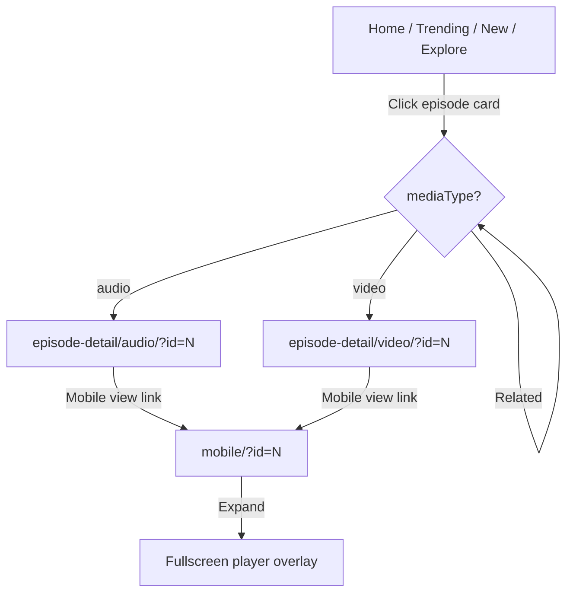

# Phase 6 — Episode Detail Pages

| Field | Value |
|-------|--------|
| **Status** | ✅ Complete |
| **Date** | 2026-06-06 |
| **Goal** | Audio/Video/Mobile episode detail pages + cross-page linking |
| **Prerequisite** | [Phase 2](./PHASE-2.md) |
| **Next Phase** | Phase 7 — SPA-lite Integration |

---

## خلاصه

۳ صفحه Episode Detail ساخته شد: **Audio Desktop**، **Video Desktop**، **Mobile unified**. Promptهای spec نوشته شد. Helper مشترک `episode-detail.js` + APIهای `getEpisodeById`, `getEpisodeUrl`, `getRelatedEpisodes` در mock-data. کارت‌های episode در Home/Trending/New Episodes/Explore به detail لینk شدند.

---

## فایل‌های ایجاد / تغییر یافته

### Prompts

| File | Action |
|------|--------|
| `prompts/AudioEpisodeDetail-Prompt.txt` | **Created** |
| `prompts/VideoEpisodeDetail-Prompt.txt` | **Created** |
| `prompts/EpisodeDetail-Mobile-Prompt.txt` | **Created** |

### Episode Detail Pages

| Path | Files |
|------|-------|
| `prototypes/episode-detail/audio/` | index.html, page.css, script.js |
| `prototypes/episode-detail/video/` | index.html, page.css, script.js |
| `prototypes/episode-detail/mobile/` | index.html, page.css, script.js |
| `prototypes/episode-detail/README.md` | **Updated** |

### Shared

| File | Action |
|------|--------|
| `shared/js/episode-detail.js` | **Created** — getFromQuery, waveform, bindPlayer, renderRelated |
| `shared/js/mock-data.js` | +routes, episodeExtras, defaultComments, getEpisodeById/Url/Related |
| `shared/css/utilities.css` | +episode link wrapper classes |

### Linking (Phase 6.5)

| File | Action |
|------|--------|
| `home/script.js` | Video/audio/new grids → detail URLs |
| `trending-video/app.js` | Episode cards linked |
| `trending-audio/script.js` | Rows linked + bookmark stopPropagation |
| `new-episodes/js/main.js` | List rows linked |
| `explore/script.js` | Video/audio/recommended linked |
| `prototypes/index.html` | Episode Detail hub section |

---

## ترتیب Load (Detail pages)

```html
<link rel="stylesheet" href="../../shared/css/castory.css">
<link rel="stylesheet" href="page.css">

<script src="../../shared/js/utils.js"></script>
<script src="../../shared/js/mock-data.js"></script>
<script src="../../shared/js/episode-detail.js"></script>
<script src="../../shared/js/castory.js"></script>
<script src="script.js"></script>
```

Audio also loads `sidebar.js`.

---

## User Flow



**URL pattern:** `index.html?id={episodeId}` — default showcase: audio **14**, video **2**.

---

## API کلیدها

| API | Usage |
|-----|-------|
| `CASTORY_MOCK.getEpisodeById(id)` | Merge episode + extras + comments |
| `CASTORY_MOCK.getEpisodeUrl(ep, prefix)` | Build detail link from list pages |
| `CASTORY_MOCK.getRelatedEpisodes(ep, limit)` | Related sidebar/grid |
| `CASTORY_MOCK.episodeExtras` | Chapters, transcript, extended description |
| `Castory.EpisodeDetail.getFromQuery(defaultId, mediaType)` | Load + wrong-type redirect |
| `Castory.EpisodeDetail.bindPlayer(opts)` | Play/pause, seek, skip |
| `Castory.EpisodeDetail.waveformHtml()` | Animated bars |
| `Castory.EpisodeDetail.renderRelated()` | Related list HTML |

---

## Preview

| Page | URL |
|------|-----|
| Audio | `prototypes/episode-detail/audio/index.html?id=14` |
| Video | `prototypes/episode-detail/video/index.html?id=2` |
| Mobile | `prototypes/episode-detail/mobile/index.html?id=14` |

---

## وضعیت Features

| Feature | Audio | Video | Mobile |
|---------|-------|-------|--------|
| Player UI | ✅ waveform | ✅ 16:9 | ✅ sticky + fullscreen |
| Progress / seek | ✅ | ✅ | ✅ |
| Skip / speed | ✅ | — | ✅ (fullscreen audio) |
| Metadata + breadcrumb | ✅ | ✅ | ✅ back btn |
| Creator + Follow | ✅ | ✅ | — |
| Related episodes | ✅ | ✅ | ✅ horizontal |
| Comments | ✅ | — | — |
| Chapters | — | ✅ | — |
| Transcript collapsible | — | ✅ | — |
| Share/Bookmark/Download | ✅ | ✅ | ✅ |

---

## Known Issues

| # | Issue | Severity |
|---|--------|----------|
| 1 | MockUp pixel QA pending (PNGs restored ✅) | 🟡 |
| 2 | Play buttons inside linked rows — bookmark stops propagation; play toggles local state only | 🟢 |
| 3 | No real media playback (simulation) | 🟢 expected |

---

## Handoff → Phase 7

- [x] Shared sidebar inject / active state sync — see [PHASE-7.md](./PHASE-7.md)
- [x] Global mini-player persist across pages
- [x] LocalStorage bookmarks / watch later (API)

---

*Previous: [PHASE-5.md](./PHASE-5.md) | Next: [PHASE-7.md](./PHASE-7.md)*
