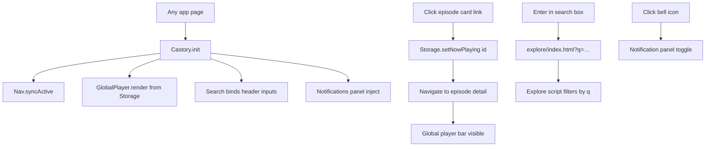

# Phase 7 — SPA-lite Integration

| Field | Value |
|-------|--------|
| **Status** | ✅ Complete |
| **Date** | 2026-06-06 |
| **Goal** | Cross-page shell: nav sync, global player, search, notifications, localStorage |
| **Prerequisite** | [Phase 6](./PHASE-6.md) |
| **Next Phase** | Phase 8 — WordPress Plugin Core — see [PHASE-8.md](./PHASE-8.md) |

---

## خلاصه

Prototype Castory به یک **SPA-lite shell** یکپارچه شد: `Castory.init()` همه صفحات app را bootstrap می‌کند، nav active state از pathname همگام می‌شود، mini-player بین صفحات persist می‌کند (localStorage)، جستجو به Explore با `?q=` redirect می‌کند، و پنل notification مشترک inject می‌شود.

---

## فایل‌های ایجاد / تغییر یافته

### Shared JS (جدید)

| File | Purpose |
|------|---------|
| `shared/js/storage.js` | `Castory.Storage` — nowPlaying, bookmarks, watchLater, theme |
| `shared/js/components/nav.js` | `Castory.Nav` — route detection + active link sync |
| `shared/js/components/global-player.js` | `Castory.GlobalPlayer` — bottom bar + progress simulation |
| `shared/js/components/notifications.js` | `Castory.Notifications` — bell panel |
| `shared/js/components/search.js` | `Castory.Search` — Enter → Explore `?q=` |

### Shared CSS (جدید)

| File | Purpose |
|------|---------|
| `shared/css/components/global-shell.css` | Global player + notification panel + lazy image fade |

### Shared JS/CSS (تغییر)

| File | Action |
|------|--------|
| `shared/js/castory.js` | Expanded `Castory.init()` + auto-boot via `data-castory-app` |
| `shared/js/utils.js` | +`Castory.lazyLoadImages()`, duplicate `getTotalPages` removed |
| `shared/js/components/sidebar.js` | Idempotent init guard (`data-castory-sidebar-init`) |
| `shared/js/mock-data.js` | +`notifications` array |
| `shared/css/castory.css` | Import `global-shell.css` |

### Pages wired

| Page | `data-castory-app` | Init notes |
|------|-------------------|------------|
| `home/` | ✅ | Auto-init |
| `explore/` | ✅ | Auto-init + `?q=` in page script |
| `library/` | ✅ | Auto-init |
| `profile/` | ✅ | Auto-init |
| `new-episodes/` | ✅ | Auto-init |
| `trending-video/` | — | Manual `Castory.init({ sidebar: false, … })` in `app.js` |
| `trending-audio/` | — | Manual init + `hydrateDates: true` in `script.js` |
| `episode-detail/audio/` | ✅ | Nav + player + notifications (no search) |
| `episode-detail/video/` | ✅ | Nav + player + notifications |
| `episode-detail/mobile/` | ✅ | Global player only (minimal mobile shell) |

---

## ترتیب Load (Standard App Page)

```html
<link rel="stylesheet" href="../shared/css/castory.css">
<link rel="stylesheet" href="page.css">

<script src="../shared/js/utils.js"></script>
<script src="../shared/js/storage.js"></script>
<script src="../shared/js/mock-data.js"></script>
<!-- optional: sidebar.js, pagination.js, filters.js, episode-detail.js -->
<script src="../shared/js/components/nav.js"></script>
<script src="../shared/js/components/global-player.js"></script>
<script src="../shared/js/components/notifications.js"></script>
<script src="../shared/js/components/search.js"></script>
<script src="../shared/js/castory.js"></script>
<script src="script.js"></script>
```

**Body:** `data-castory-app` → `Castory.init()` on `DOMContentLoaded`.

**Manual init (trending pages):**

```javascript
Castory.init({
  sidebar: false,
  nav: true,
  globalPlayer: true,
  search: true,
  notifications: true,
  hydrateDates: true, // trending-audio only
});
```

---

## User Flow



---

## Workflow توسعه

1. صفحه جدید → `castory.css` + stack بالا + `data-castory-app`
2. اگر sidebar drawer سفارشی → `sidebar.js` + `Castory.Sidebar.init({…})` در page script (idempotent)
3. اگر layout بدون sidebar → `Castory.init({ sidebar: false })` دستی
4. Bookmark/watchLater → `Castory.Storage.toggleBookmark(id)` (UI wiring در فاز بعد)
5. Theme → `Castory.Storage.setTheme('dark'|'light')` (UI toggle هنوز نیست)

---

## API کلیدها

| API | Description |
|-----|-------------|
| `Castory.init(options)` | Bootstrap shell components |
| `Castory.Storage.get/set` | Generic localStorage JSON |
| `Castory.Storage.setNowPlaying(id, progress)` | Persist + refresh global player |
| `Castory.Storage.toggleBookmark(id)` | Toggle bookmark list |
| `Castory.Storage.toggleWatchLater(id)` | Toggle watch-later list |
| `Castory.Storage.applyTheme()` | Apply `data-theme` on `<html>` |
| `Castory.Nav.getRoute()` | `home` \| `explore` \| `library` \| `profile` \| `trending` \| `episode` |
| `Castory.Nav.syncActive()` | Match `.active` on nav links |
| `Castory.Nav.getPathPrefix()` | Relative `../` depth for links |
| `Castory.GlobalPlayer.init/render()` | Inject + show/hide bar |
| `Castory.Search.redirect(q)` | Navigate to Explore with query |
| `Castory.Notifications.toggle()` | Open/close panel |
| `Castory.lazyLoadImages()` | Fade-in for `img[loading="lazy"]` |
| `CASTORY_MOCK.notifications` | Mock notification items |

---

## Preview & Files

| Resource | Path |
|----------|------|
| Dev hub | `prototypes/index.html` |
| Design system | `prototypes/shared/preview.html` |
| Demo flow | Home → click episode → detail → back → global player persists |
| Search demo | Any search box → Enter → Explore filtered |

---

## وضعیت Features

| Feature | Status |
|---------|--------|
| Nav active sync (sidebar + bottom) | ✅ |
| Global mini-player | ✅ |
| Global search → Explore | ✅ |
| Notification panel | ✅ |
| localStorage persistence | ✅ API |
| Bookmark UI wired everywhere | 🟡 partial (API only) |
| Theme toggle UI | 🔲 deferred |
| Lazy load images | ✅ |
| Accessibility audit | 🔲 Phase 7.3 deferred |
| SEO meta / Open Graph | 🔲 deferred |
| Cross-browser QA | 🔲 manual |

---

## Known Issues

| # | Issue | Severity |
|---|--------|----------|
| 1 | Bookmark/watchLater buttons not all wired to `Castory.Storage` | 🟡 |
| 2 | No theme toggle in UI (storage ready) | 🟢 |
| 3 | Global player simulates progress; no real audio element | 🟢 expected |
| 4 | Explore/library/profile call `Sidebar.init` after auto-init (safe via guard) | 🟢 |
| 5 | MockUp PNG assets still missing | 🟡 |

---

## Handoff → Phase 8

- [ ] Scaffold `plugin/castory/castory.php`
- [ ] Enqueue shared CSS/JS from plugin
- [ ] Replace `CASTORY_MOCK` with REST + `wp_localize_script`
- [ ] Wire bookmark/watchLater to user meta or custom tables
- [ ] Optional: complete Phase 7.3 quality (a11y, SEO, cross-browser)

---

*Previous: [PHASE-6.md](./PHASE-6.md) | Next: Phase 8 — WordPress Plugin Core*
