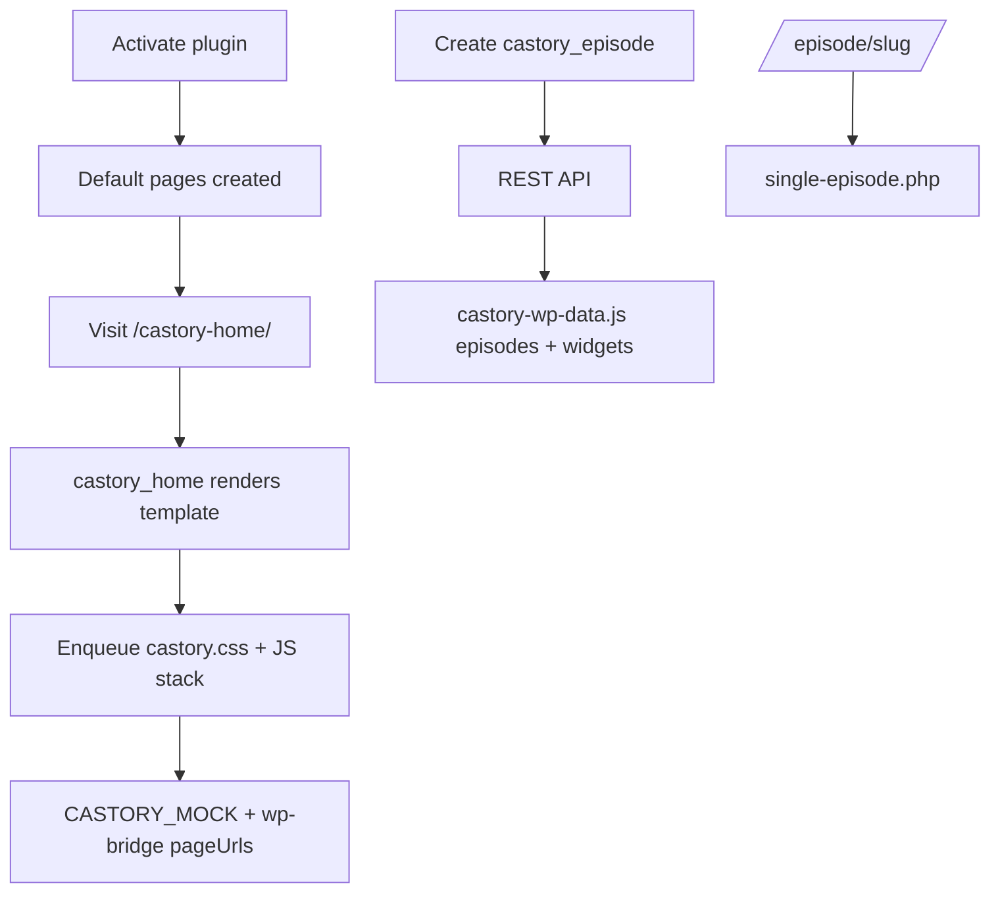

# Phase 8 — WordPress Plugin Core

| Field | Value |
|-------|--------|
| **Status** | ✅ Core complete |
| **Date** | 2026-06-06 |
| **Goal** | Installable WP plugin: scaffold, CPT, assets, shortcodes, REST |
| **Prerequisite** | [Phase 7](./PHASE-7.md) |
| **Next Phase** | [Phase 9](./PHASE-9.md) |

---

## خلاصه

پیش‌نیازهای فاز ۸ انجام شد: **plugin scaffold**، **CPT/taxonomies**، **asset pipeline** (sync از prototypes)، **7 shortcode** + صفحات پیش‌فرض روی activation، **REST API** + **frontend hydration** (`castory-wp-data.js`)، **port کامل همه templateها** از prototype، **Admin settings** + episode meta box + sample importer. مستندات stale (`README`, `review.md`) به‌روز شد. cleanup prototype (orphan CSS، `home.css` → `page.css`).

---

## فایل‌های ایجاد / تغییر یافته

### WordPress Plugin (`plugin/castory/`)

| File | Purpose |
|------|---------|
| `castory.php` | Plugin bootstrap |
| `uninstall.php` | Delete options on uninstall |
| `includes/class-castory.php` | Main orchestrator |
| `includes/class-loader.php` | Hook registry |
| `includes/class-activator.php` | Pages + options + flush rewrites |
| `includes/class-deactivator.php` | Flush rewrites |
| `includes/class-i18n.php` | Text domain |
| `includes/class-post-types.php` | `castory_episode`, `castory_podcast`, taxonomies |
| `includes/class-templates.php` | Template loader + page URLs |
| `includes/class-rest-api.php` | REST: episodes, widgets, creators, trending, progress |
| `includes/class-user-progress.php` | Playback positions in user meta (Phase 9) |
| `includes/class-widget-data.php` | Hero/creators/topics from CPT + taxonomies |
| `includes/class-episode-routing.php` | `/episode/{slug}/` + legacy redirect |
| `templates/single-episode.php` | Native CPT single template |
| `admin/class-admin.php` | Settings page + episode meta box |
| `public/class-public.php` | Conditional asset enqueue |
| `public/class-shortcodes.php` | `[castory_*]` registration |
| `public/js/castory-wp-bridge.js` | Patch mock routes from `castoryConfig` |
| `public/js/castory-wp-data.js` | REST hydration for episodes |
| `includes/class-sample-data.php` | Demo episodes on activation + admin import |
| `public/css|js/` | Synced from `prototypes/shared/` + page assets |
| `templates/*.php` | home, explore, library, profile, trending, new-episodes, episode-detail + partials |

### Docs & Tooling

| File | Action |
|------|--------|
| `README.md` | Updated — Phase 8, WP install, all pages |
| `docs/review.md` | Rewritten — current implementation matrix |
| `docs/DECISIONS.md` | ADR-001 PodStream replacement marked done |
| `scripts/sync-assets.ps1` | Prototype → plugin asset sync |
| `plugin/castory/README.md` | Plugin install guide |

### Prototype Cleanup

| File | Action |
|------|--------|
| `prototypes/home/home.css` | **Renamed** → `page.css` |
| `prototypes/trending-*/styles.css` | **Deleted** (orphan) |
| `prototypes/new-episodes/css/style.css` | **Deleted** (orphan) |
| `prototypes/shared/js/mock-data.js` | +Explore in `nav` array |

---

## نصب Plugin

```
wp-content/plugins/castory/   ← copy plugin/castory/
WP Admin → Plugins → Activate "Castory Podcast"
```

صفحات ایجادشده: `castory-home`, `castory-explore`, `castory-library`, `castory-profile`, `castory-trending-video`, `castory-trending-audio`, `castory-new-episodes`, `castory-episode`.

---

## Shortcodes

| Shortcode | Template | Assets |
|-----------|----------|--------|
| `[castory_home]` | `templates/home.php` | ✅ |
| `[castory_explore]` | `templates/explore.php` | ✅ |
| `[castory_library]` | `templates/library.php` | ✅ |
| `[castory_profile]` | `templates/profile.php` | ✅ |
| `[castory_trending type="video\|audio"]` | `trending-video.php` / `trending-audio.php` | ✅ |
| `[castory_new_episodes]` | `templates/new-episodes.php` | ✅ |
| `[castory_episode id="N"]` | `episode-detail.php` + audio/video partial | ✅ |

---

## REST API

```
GET /wp-json/castory/v1/episodes?page=1&per_page=12&media_type=video&category=AI&search=term
GET /wp-json/castory/v1/episodes/{id}
GET /wp-json/castory/v1/widgets
GET /wp-json/castory/v1/creators?limit=8
GET /wp-json/castory/v1/trending?media_type=video&limit=12
```

`castory-wp-data.js` hydrates `CASTORY_MOCK.episodes` + widget keys (`heroSlides`, `creators`, `popularCreators`, `trendingTopicsExplore`, …) when CPT data exists. Page scripts wait via `Castory.whenReady()`.

Episode permalinks: `/episode/{post-slug}/` (CPT rewrite). Legacy `/castory-episode/?id=N` redirects 301 to permalink. `getEpisodeUrl()` prefers `episode.permalink` from REST.

---

## Asset Pipeline

1. Edit `prototypes/shared/` or page CSS/JS
2. Run `.\scripts\sync-assets.ps1`
3. Plugin loads via `wp_enqueue_style/script` when shortcode detected (`has_shortcode` + view registry)

`castoryConfig` on `castory-mock-data`: `restUrl`, `nonce`, `pageUrls`, `pluginUrl`, `currentEpisodeId`, `usePermalinks`.

---

## User Flow (WordPress)



---

## وضعیت Roadmap 8.x

| Section | Status |
|---------|--------|
| 8.1 Scaffold | ✅ |
| 8.2 CPT + taxonomies | ✅ foundation |
| 8.3 Asset pipeline | ✅ sync + enqueue |
| 8.4 Templates + shortcodes | ✅ full port + conditional enqueue |
| 8.5 REST API | 🟡 episodes/widgets/creators/trending ✅; user library pending |
| 8.6 Admin UI | 🟡 settings + episode meta + sample import; RSS import pending |

---

## Known Issues

| # | Issue | Severity |
|---|--------|----------|
| 1 | Profile/library widgets still mock (user REST in Phase 9) | 🟡 partial |
| 2 | MockUp pixel QA pending — [QA-MOCKUP-CHECKLIST.md](../QA-MOCKUP-CHECKLIST.md) | 🟡 |
| 3 | Gutenberg blocks not started | 🟢 optional |

---

## Handoff → Phase 8 completion / Phase 9

- [x] Port all templates from prototypes HTML
- [x] `castory-wp-data.js` — episode REST hydration
- [x] Extend REST to hero/creators/widgets
- [x] Sample content importer (activation + admin)
- [x] Episode permalink `/episode/{slug}/` + legacy redirect
- [ ] User library / watch-later REST (auth)
- [x] Phase 9.2 — real HTML5 player — [PLAYER.md](../PLAYER.md)
- [ ] Phase 9.3+ — premium, WP user integration

---

*Previous: [PHASE-7.md](./PHASE-7.md)*
