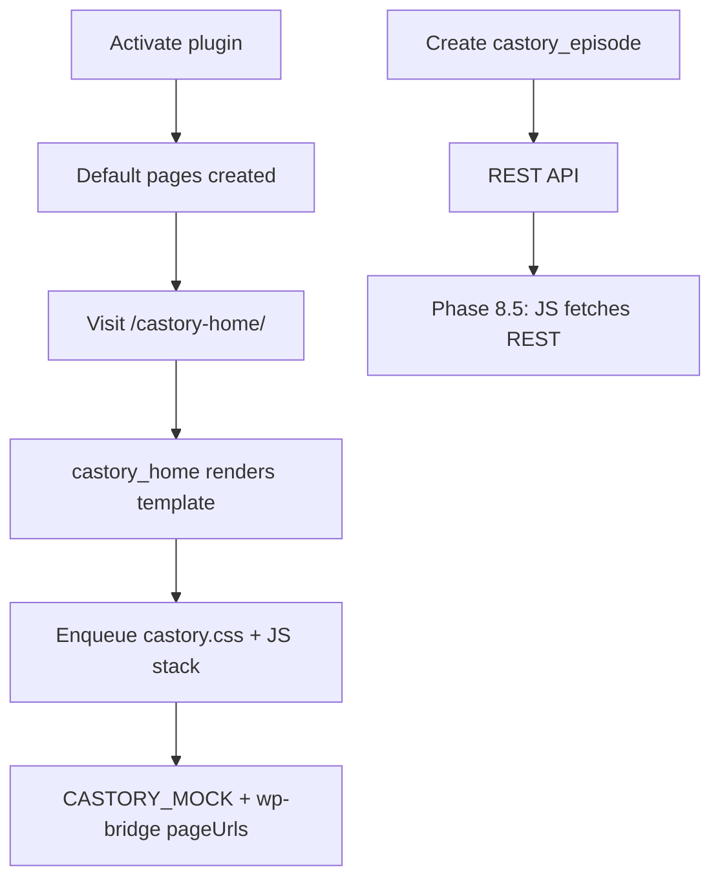

# Phase 8 — WordPress Plugin Core

| Field | Value |
|-------|--------|
| **Status** | 🔄 In Progress (foundation complete) |
| **Date** | 2026-06-06 |
| **Goal** | Installable WP plugin: scaffold, CPT, assets, shortcodes, REST |
| **Prerequisite** | [Phase 7](./PHASE-7.md) |
| **Next Phase** | Phase 8.4–8.6 completion → Phase 9 |

---

## خلاصه

پیش‌نیازهای فاز ۸ انجام شد: **plugin scaffold**، **CPT/taxonomies**، **asset pipeline** (sync از prototypes)، **7 shortcode** + صفحات پیش‌فرض روی activation، **REST API** پایه، **Admin settings** + episode meta box. مستندات stale (`README`, `review.md`) به‌روز شد. cleanup prototype (orphan CSS، `home.css` → `page.css`).

---

## فایل‌های ایجاد / تغییر یافته

### WordPress Plugin (`plugin/castory/`)

| File | Purpose |
|------|---------|
| `castory.php` | Plugin bootstrap |
| `uninstall.php` | Delete options on uninstall |
| `includes/class-castory.php` | Main orchestrator |
| `includes/class-loader.php` | Hook registry |
| `includes/class-activator.php` | Pages + options + flush rewrites |
| `includes/class-deactivator.php` | Flush rewrites |
| `includes/class-i18n.php` | Text domain |
| `includes/class-post-types.php` | `castory_episode`, `castory_podcast`, taxonomies |
| `includes/class-templates.php` | Template loader + page URLs |
| `includes/class-rest-api.php` | `/castory/v1/episodes` |
| `admin/class-admin.php` | Settings page + episode meta box |
| `public/class-public.php` | Conditional asset enqueue |
| `public/class-shortcodes.php` | `[castory_*]` registration |
| `public/js/castory-wp-bridge.js` | Patch mock routes from `castoryConfig` |
| `public/css|js/` | Synced from `prototypes/shared/` + page assets |
| `templates/home.php` | Full home markup |
| `templates/explore.php` | Full explore markup |
| `templates/_shell.php` | Shell for pending template ports |
| `templates/*.php` | library, profile, trending, new-episodes, episode-detail |

### Docs & Tooling

| File | Action |
|------|--------|
| `README.md` | Updated — Phase 8, WP install, all pages |
| `docs/review.md` | Rewritten — current implementation matrix |
| `docs/DECISIONS.md` | ADR-001 PodStream replacement marked done |
| `scripts/sync-assets.ps1` | Prototype → plugin asset sync |
| `plugin/castory/README.md` | Plugin install guide |

### Prototype Cleanup

| File | Action |
|------|--------|
| `prototypes/home/home.css` | **Renamed** → `page.css` |
| `prototypes/trending-*/styles.css` | **Deleted** (orphan) |
| `prototypes/new-episodes/css/style.css` | **Deleted** (orphan) |
| `prototypes/shared/js/mock-data.js` | +Explore in `nav` array |

---

## نصب Plugin

```
wp-content/plugins/castory/   ← copy plugin/castory/
WP Admin → Plugins → Activate "Castory Podcast"
```

صفحات ایجادشده: `castory-home`, `castory-explore`, `castory-library`, `castory-profile`, `castory-trending-video`, `castory-trending-audio`, `castory-new-episodes`, `castory-episode`.

---

## Shortcodes

| Shortcode | Template | Assets |
|-----------|----------|--------|
| `[castory_home]` | `templates/home.php` | ✅ full |
| `[castory_explore]` | `templates/explore.php` | ✅ full |
| `[castory_library]` | `_shell.php` | 🟡 port pending |
| `[castory_profile]` | `_shell.php` | 🟡 port pending |
| `[castory_trending type="video\|audio"]` | `_shell.php` | 🟡 port pending |
| `[castory_new_episodes]` | `_shell.php` | 🟡 port pending |
| `[castory_episode id="N"]` | `episode-detail.php` | 🟡 port pending |

---

## REST API

```
GET /wp-json/castory/v1/episodes?page=1&per_page=12&media_type=video&category=AI&search=term
GET /wp-json/castory/v1/episodes/{id}
```

Response shape matches prototype `CASTORY_MOCK` episode objects (for future JS migration).

---

## Asset Pipeline

1. Edit `prototypes/shared/` or page CSS/JS
2. Run `.\scripts\sync-assets.ps1`
3. Plugin loads via `wp_enqueue_style/script` when shortcode detected (`has_shortcode` + view registry)

`castoryConfig` localized on `castory-mock-data`: `restUrl`, `nonce`, `pageUrls`, `pluginUrl`.

---

## User Flow (WordPress)



---

## وضعیت Roadmap 8.x

| Section | Status |
|---------|--------|
| 8.1 Scaffold | ✅ |
| 8.2 CPT + taxonomies | ✅ foundation |
| 8.3 Asset pipeline | ✅ sync + enqueue |
| 8.4 Templates + shortcodes | 🟡 home + explore full; others shell |
| 8.5 REST API | 🟡 episodes list + single |
| 8.6 Admin UI | 🟡 settings + episode meta; RSS import pending |

---

## Known Issues

| # | Issue | Severity |
|---|--------|----------|
| 1 | Shell templates for library/profile/trending/new/episode | 🟡 8.4 |
| 2 | Frontend JS still uses CASTORY_MOCK not REST | 🟡 8.5 |
| 3 | No sample episode importer on activation | 🟢 |
| 4 | MockUp PNGs missing | 🟡 |
| 5 | Gutenberg blocks not started | 🟢 optional |

---

## Handoff → Phase 8 completion / Phase 9

- [ ] Port remaining templates from prototypes HTML
- [ ] `castory-wp-data.js` — fetch episodes from REST, drop mock in production
- [ ] Sample content importer (mock → CPT)
- [ ] Episode single template routing `/episode/{slug}/`
- [ ] User library / watch-later REST (auth)
- [ ] Phase 9 — real player, premium, WP user integration

---

*Previous: [PHASE-7.md](./PHASE-7.md)*
